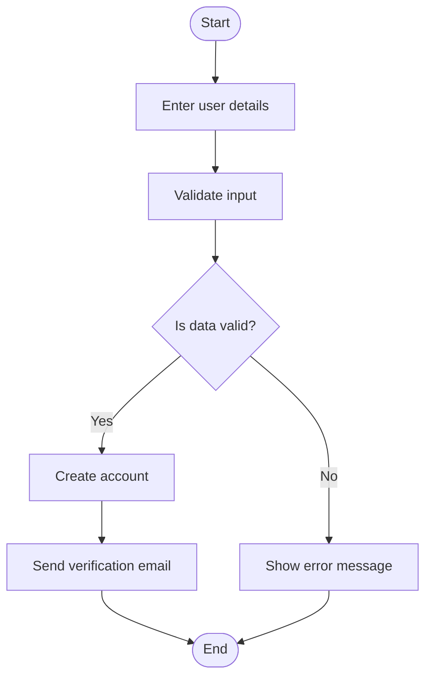
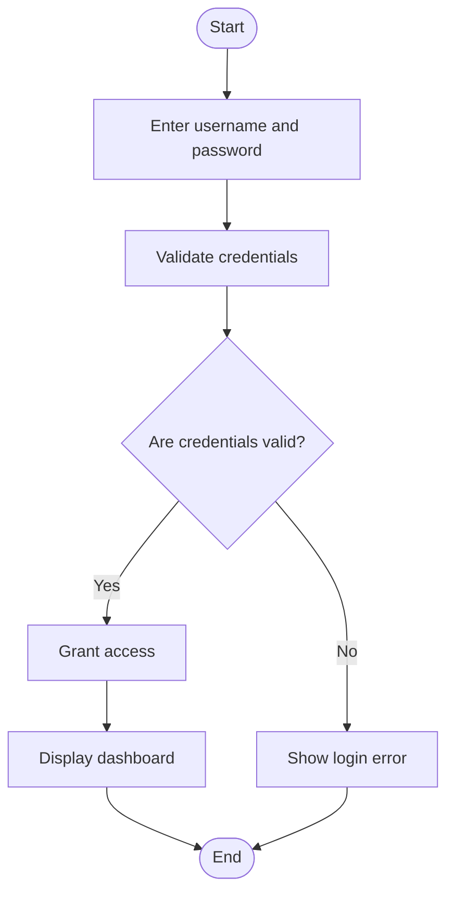
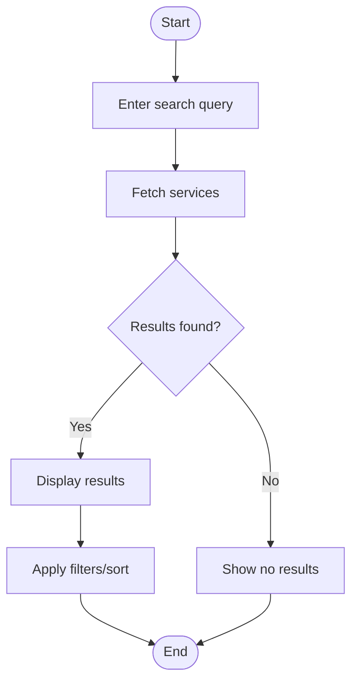
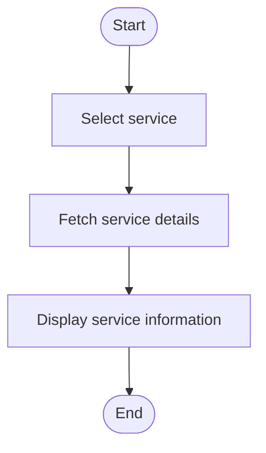
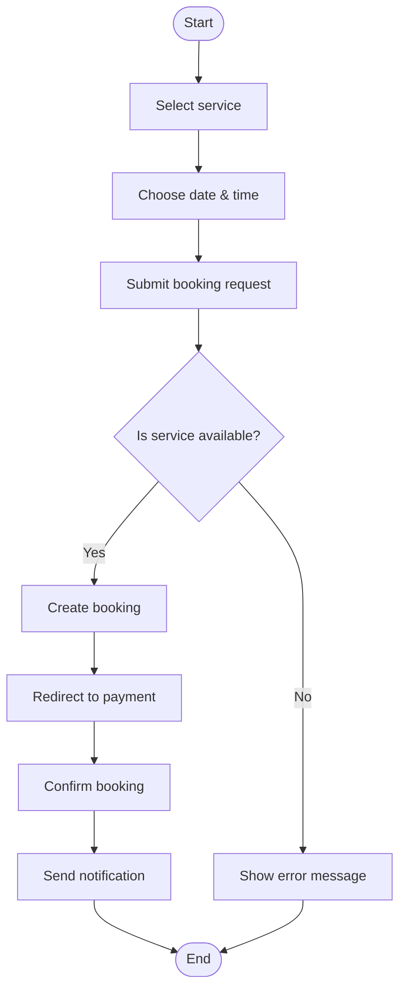
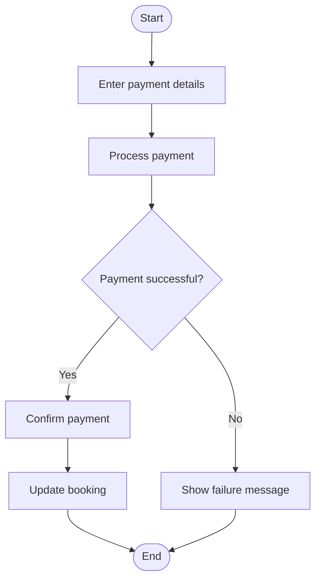
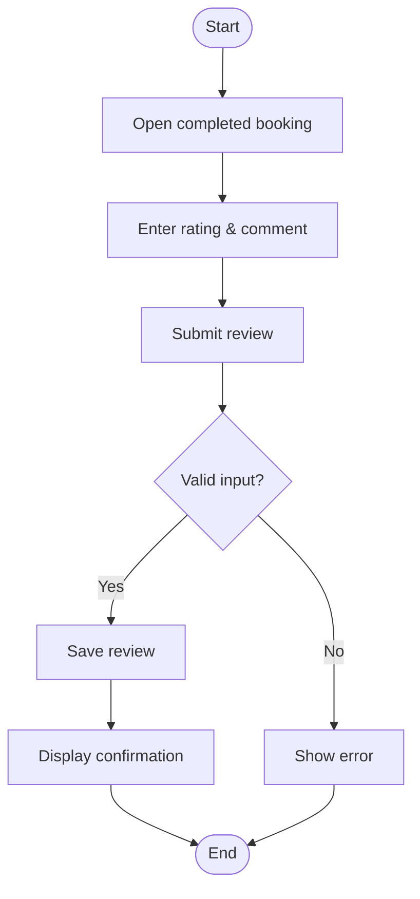
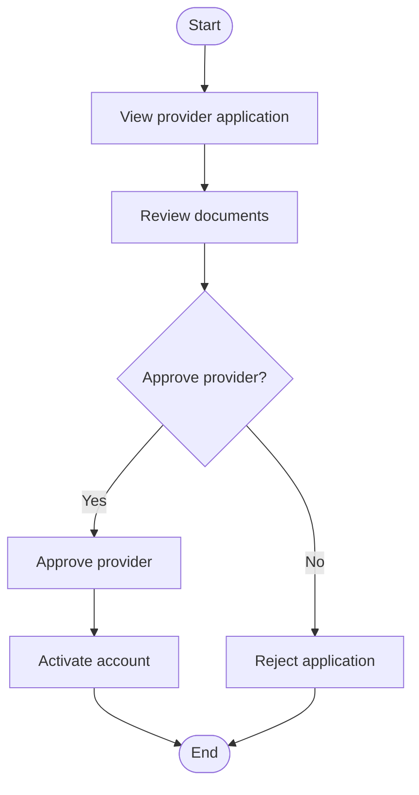

# Activity Diagrams – ServiceHub AI

This document presents the activity diagrams representing key workflows of the ServiceHub AI system.

# Activity Diagram – User Registration

## Explanation

This diagram represents the user registration process. The system validates user input before creating an account. If validation fails, an error is shown.

### Traceability

Functional Requirements:

* FR1 – User Registration

User Stories:

* US-001: User Registration
========================================================================================

# Activity Diagram – User Login

## Explanation

The login workflow verifies user credentials before granting access to the system dashboard.

### Traceability

Functional Requirements:

* FR2 – User Authentication

User Stories:

* US-002: User Login
========================================================================================

# Activity Diagram – Search Services

## Explanation

Users search for services and receive filtered results. If no services are found, the system displays an appropriate message.

### Traceability

Functional Requirements:

* FR3 – Service Search

User Stories:

* US-003: Search Services
========================================================================================

# Activity Diagram – View Service Details

## Explanation

This workflow shows how users view detailed information about a selected service.

### Traceability

Functional Requirements:

* FR4 – Service Listing

User Stories:

* US-004: View Service Details
========================================================================================

# Activity Diagram – Book Service

## Explanation

This diagram illustrates the booking workflow, including availability checks and confirmation.

### Traceability

Functional Requirements:

* FR5 – Booking Management
* FR6 – Payment Processing

User Stories:

* US-005: Book Service
========================================================================================

# Activity Diagram – Make Payment

## Explanation

This workflow handles payment processing and updates the booking status accordingly.

### Traceability

Functional Requirements:

* FR6 – Payment Processing

User Stories:

* US-006: Make Payment
========================================================================================

# Activity Diagram – Leave Review

## Explanation

Users provide feedback after service completion. Validation ensures meaningful reviews.

### Traceability

Functional Requirements:

* FR8 – Review System

User Stories:

* US-007: Leave Review
========================================================================================

# Activity Diagram – Approve Provider

## Explanation

Admins evaluate provider applications and decide whether to approve or reject them.

### Traceability

Functional Requirements:

* FR7 – Provider Approval

User Stories:

* US-010: Approve Providers
========================================================================================

