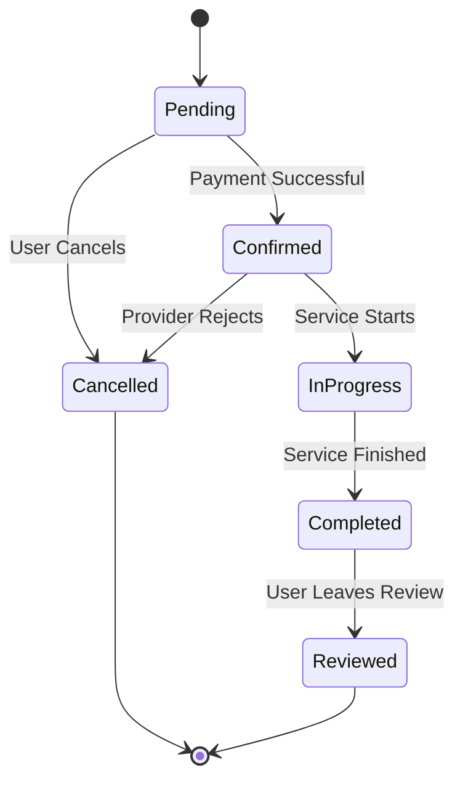
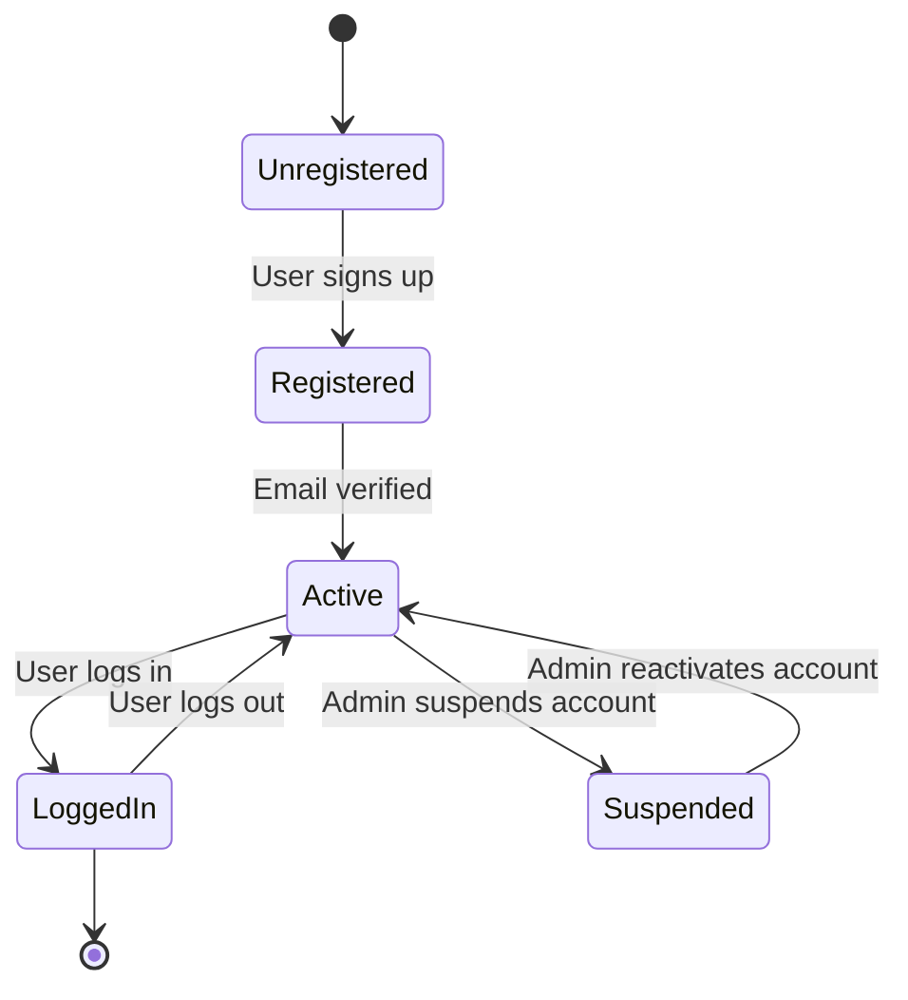
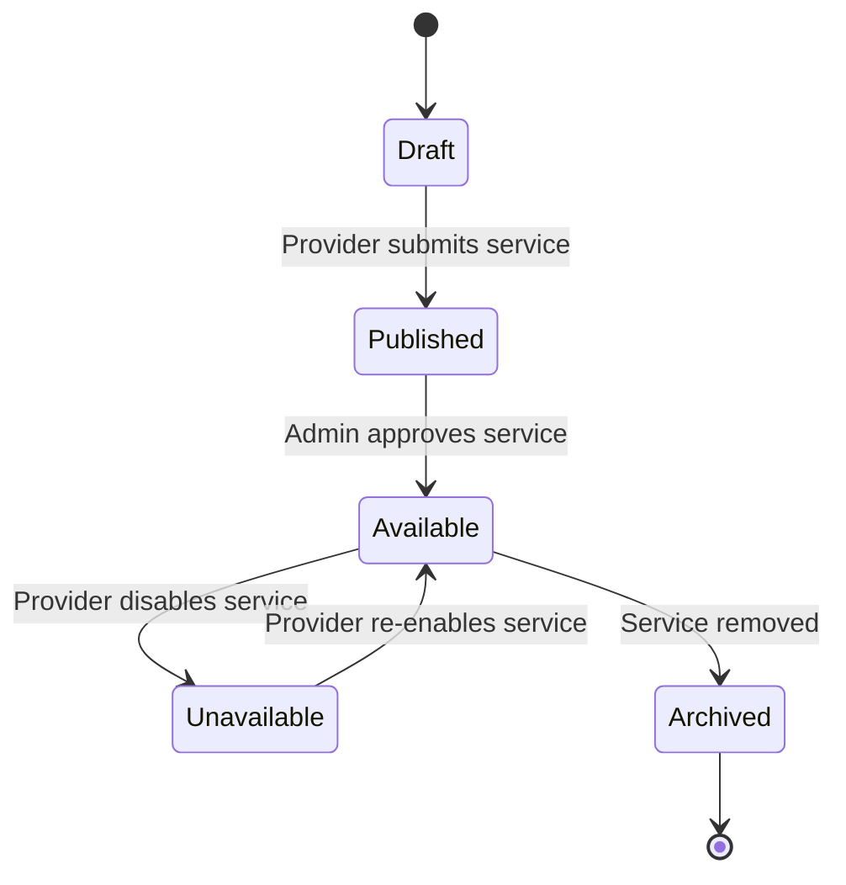
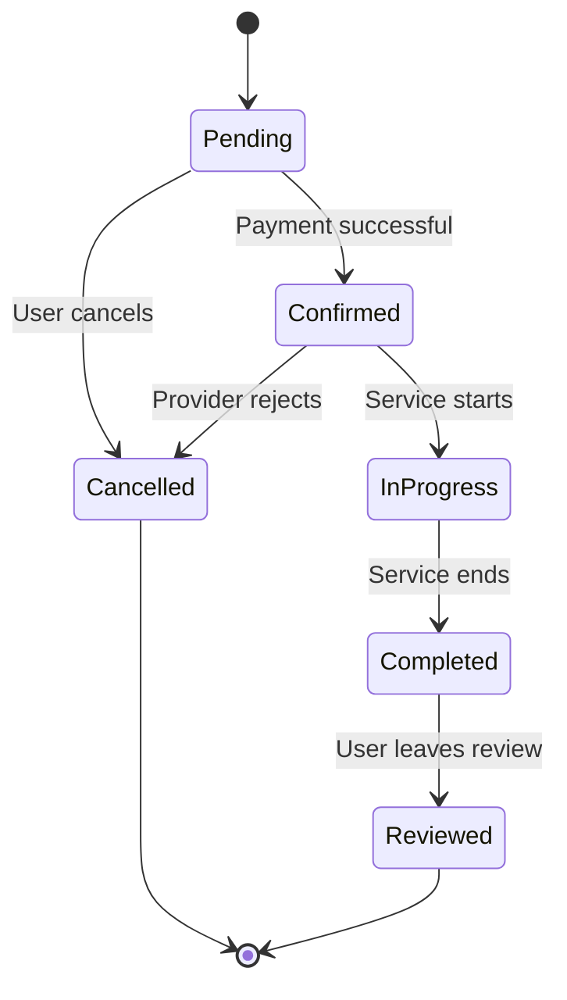
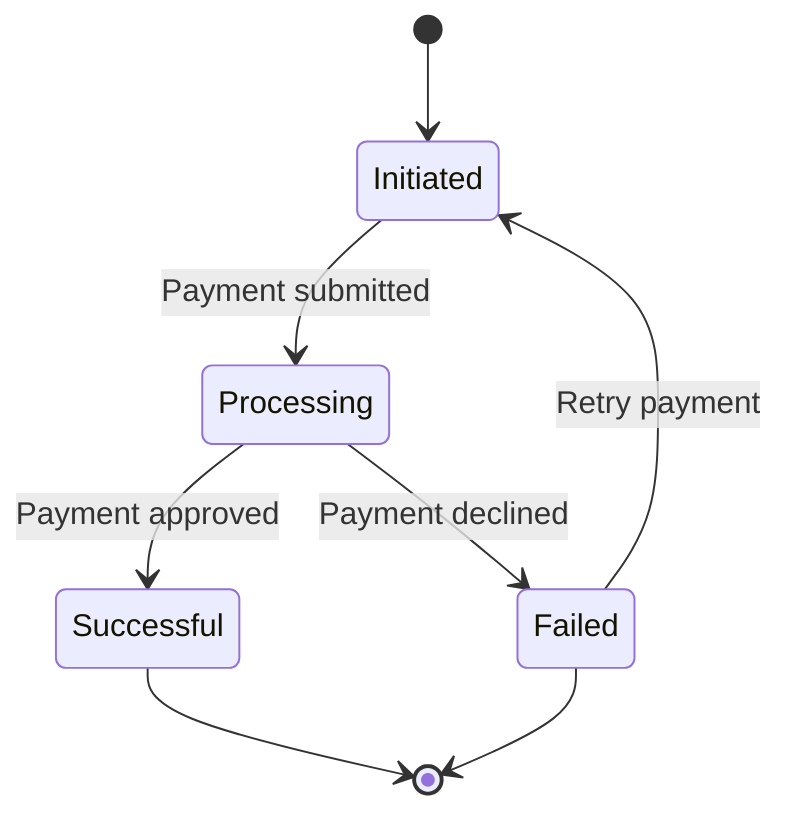
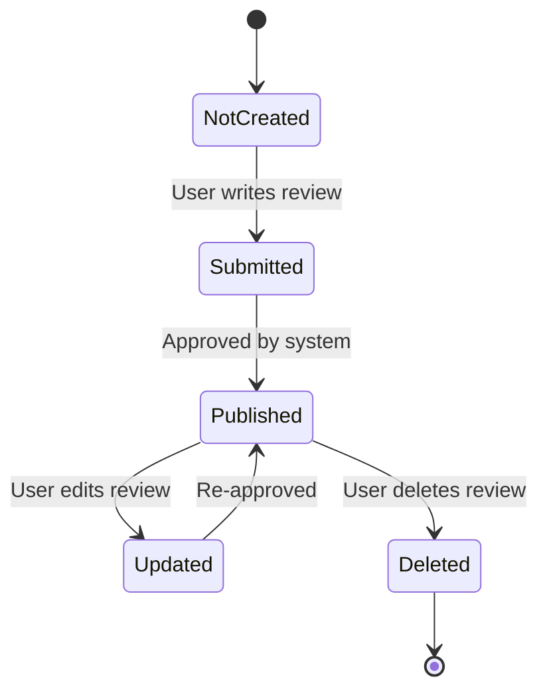
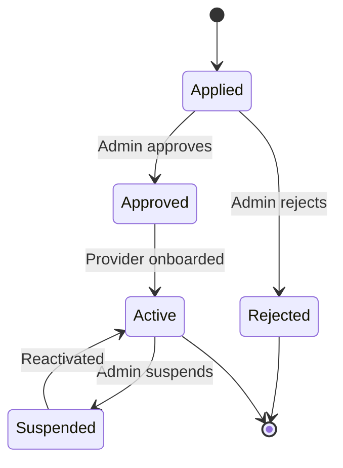
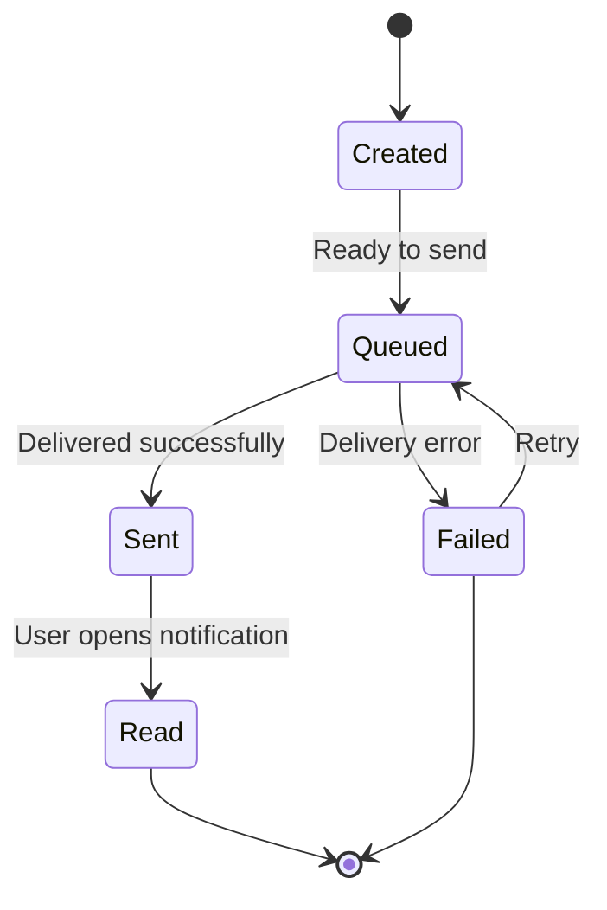

# State Transition Diagrams – ServiceHub AI

This document presents the state transition diagrams for key system entities within the ServiceHub AI platform. These diagrams illustrate how objects change state over time in response to events and actions within the system.

----------------------------------------------------------------------------------------

# State Transition Diagram – Booking

## Explanation

The Booking object transitions through multiple states from creation to completion.

* **Pending**: Initial state after booking is created.
* **Confirmed**: Booking is confirmed after successful payment.
* **InProgress**: Service is being delivered.
* **Completed**: Service has been successfully completed.
* **Reviewed**: Customer leaves feedback.
* **Cancelled**: Booking is cancelled by user or provider.

This diagram directly maps to:

* **FR5 – Booking Management**
* **FR6 – Payment Processing**
* **FR8 – Review System**

----------------------------------------------------------------------------------------
# State Transition Diagram – User Account

## Explanation

The User Account object represents the lifecycle of a system user.

* **Unregistered**: Initial state before account creation
* **Registered**: Account created but not yet verified
* **Active**: Verified and usable account
* **LoggedIn**: User currently accessing the system
* **Suspended**: Account restricted by administrator

This diagram ensures proper control over authentication and user management.

### Traceability

Functional Requirements:

* FR1 – User Registration
* FR2 – User Authentication

User Stories:

* US-001: User Registration
* US-002: User Login

----------------------------------------------------------------------------------------

# State Transition Diagram – Service

## Explanation

The Service object represents offerings created by providers.

* **Draft**: Service being created
* **Published**: Submitted for approval
* **Available**: Visible to customers
* **Unavailable**: Temporarily disabled
* **Archived**: Permanently removed

### Traceability

Functional Requirements:

* FR4 – Service Management

User Stories:

* US-008: Manage Services
----------------------------------------------------------------------------------------

# State Transition Diagram – Booking

## Explanation

The Booking object tracks service reservations.

* **Pending**: Awaiting payment
* **Confirmed**: Payment completed
* **InProgress**: Service being delivered
* **Completed**: Service finished
* **Reviewed**: Feedback added
* **Cancelled**: Booking terminated

### Traceability

Functional Requirements:

* FR5 – Booking Management
* FR6 – Payment Processing
* FR8 – Review System

User Stories:

* US-005: Book Service
* US-006: Make Payment
* US-007: Leave Review

----------------------------------------------------------------------------------------

# State Transition Diagram – Payment

## Explanation

The Payment object manages financial transactions.

* **Initiated**: Payment started
* **Processing**: Payment under verification
* **Successful**: Payment completed
* **Failed**: Payment unsuccessful

### Traceability

Functional Requirements:

* FR6 – Payment Processing

User Stories:

* US-006: Make Payment
----------------------------------------------------------------------------------------

# State Transition Diagram – Review

## Explanation

The Review object manages customer feedback.

* **NotCreated**: No review exists
* **Submitted**: Review submitted
* **Published**: Visible to others
* **Updated**: Edited review
* **Deleted**: Removed

### Traceability

Functional Requirements:

* FR8 – Review System

User Stories:

* US-007: Leave Review
----------------------------------------------------------------------------------------

# State Transition Diagram – Provider

## Explanation

The Provider object represents service providers.

* **Applied**: Registration submitted
* **Approved**: Verified by admin
* **Active**: Providing services
* **Suspended**: Temporarily blocked
* **Rejected**: Application denied

### Traceability

Functional Requirements:

* FR7 – Provider Approval

User Stories:

* US-010: Approve Providers
----------------------------------------------------------------------------------------

# State Transition Diagram – Notification

## Explanation

The Notification object manages system alerts.

* **Created**: Notification generated
* **Queued**: Waiting to send
* **Sent**: Delivered
* **Read**: Seen by user
* **Failed**: Delivery failed

### Traceability

Functional Requirements:

* FR9 – Notification System

User Stories:

* US-011: Send Notifications

