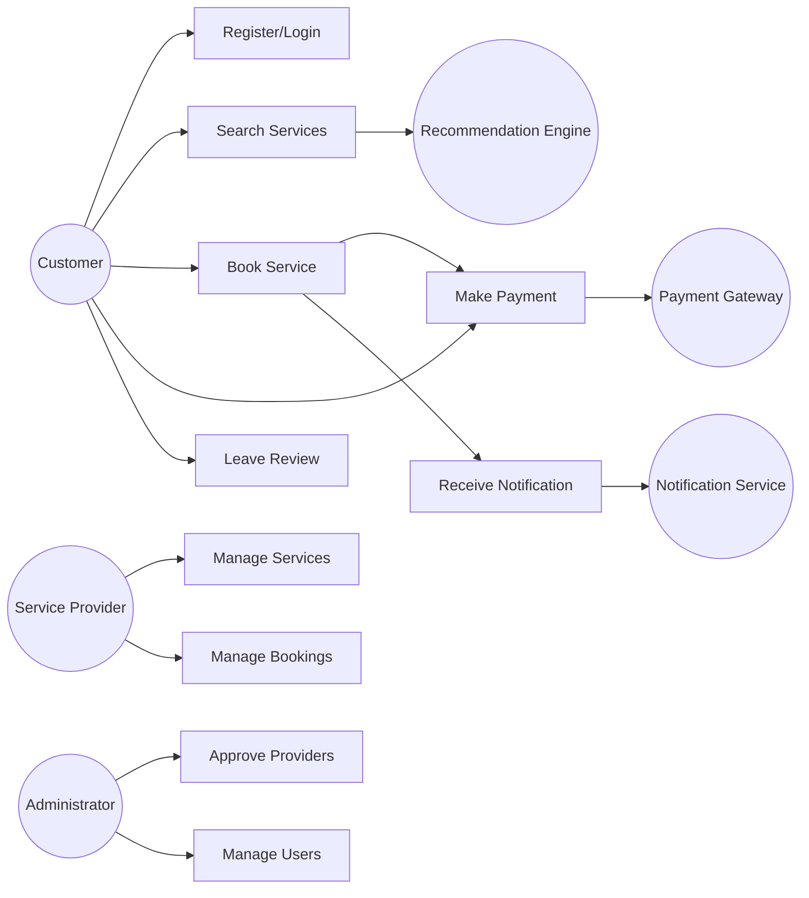

# Use Case Diagram – ServiceHub AI

## Explanation

The diagram illustrates how different actors interact with the ServiceHub AI system.

* **Customer** performs core actions such as searching services, booking, and reviewing.
* **Service Provider** manages services and bookings.
* **Administrator** ensures system governance and user management.
* External systems like the **Payment Gateway**, **Notification Service**, and **AI Engine** support key system operations.

Relationships:

* “Book Service” includes “Make Payment”
* Notifications are triggered after booking
* AI recommendations enhance service discovery

This directly supports stakeholder concerns such as ease of booking, reliable payments, and improved user experience.
